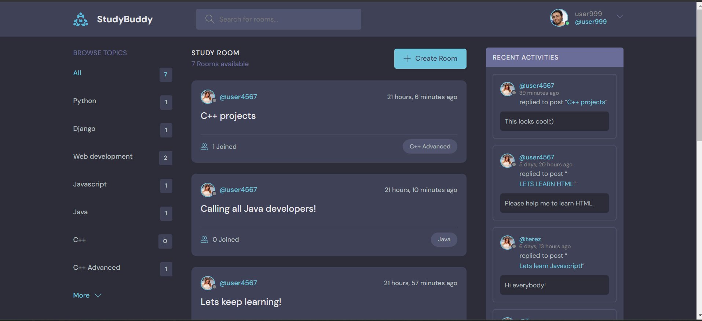
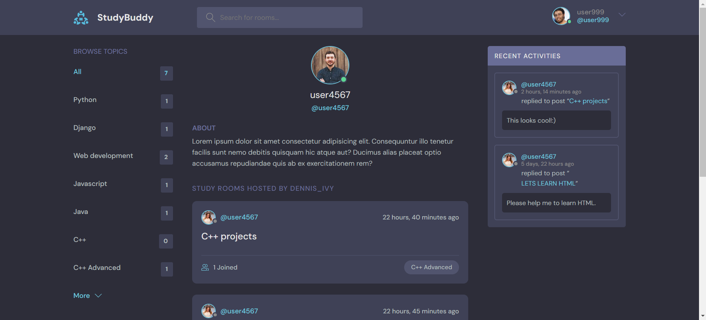

<h1 align="center">
  STUDY BUDDY
</h1>

### Project features

**&bull; Setup:**
Setting up the environment and installing necessary dependencies.

**&bull; Views and URLs:**
Creating basic views.
Defining URL patterns for each view.

**&bull; Templates:**
Creating HTML templates for views.

**&bull; Database and Admin Panel:**
Configuring the database.
Adding an administrative interface.

**&bull; CRUD Operations:**
Implementing functionality for Create, Read, Update, and Delete operations.

**&bull; Search:**
Adding search functionality.

**&bull; User Login and Logout:**
Implementing functionality for user login and logout.

**&bull; Flash Messages:**
Displaying messages for users.

**&bull; Restricted Access:**
Setting up restricted access to certain pages.

**&bull; User Registration:**
Implementing a registration form

**&bull; CRUD Operations for Chat Room Messages:**
Creating functionality for manipulating messages in a chat room.

**&bull; Activity Feed:**
Implementing user activity.

**&bull; User Profile:**
Creating a user profile page.

**&bull; Static Files:**
Managing static files.
Installing and applying a design theme.

**&bull; Edit User Account Page:**
Creating a page for editing user accounts.

<hr>

### Upcoming Project features

**&bull; Adding Bootsrap5:**
Mobile Responsiveness

**&bull; Django REST Framework**

**&bull; Customizing User model**

**&bull; Integrating Custom User Model**

<hr>

### Cloning the repository

--> Clone the repository

--> Move into the directory where we have the project files : 
```bash
cd studybud

```

--> Create a virtual environment :
```bash
# Let's install virtualenv first
pip install virtualenv

# Then we create our virtual environment
virtualenv envname

```

--> Activate the virtual environment :
```bash
envname\scripts\activate

```

--> Install the requirements :
```bash
pip install -r requirements.txt

```

#

### Running the App

--> To run the App, we use :
```bash
python manage.py runserver

```

> ⚠ Then, the development server will be started at http://127.0.0.1:8000/

#

### App Preview :

<table width="100%"> 
<tr>
<td width="50%">      
&nbsp; 
<br>
<p align="center">
  Home Feed
</p>

</td> 
<td width="50%">
<br>
<p align="center">
  Profile Feed
</p>
 
</td>
</table>


